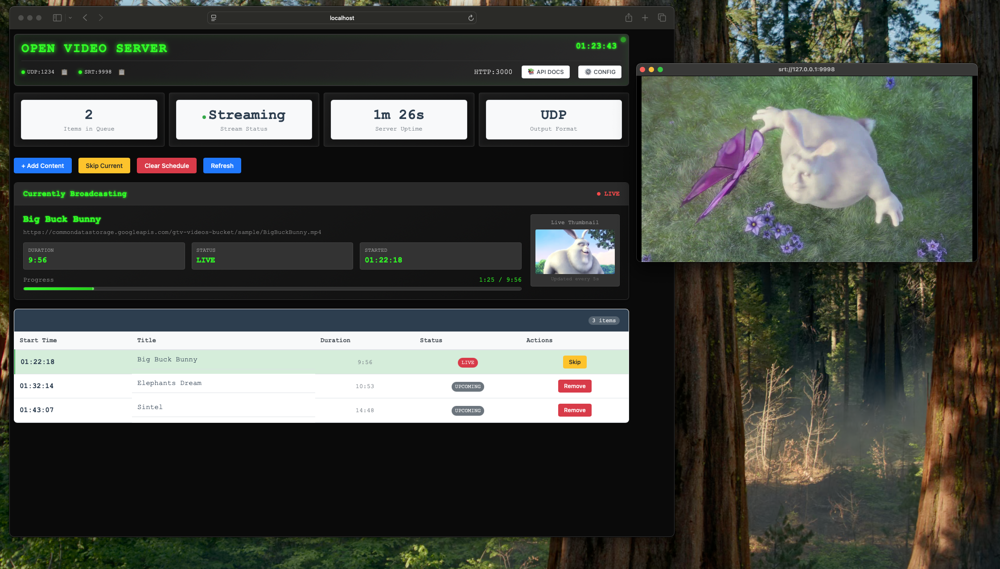

# Open Video Server

[](https://opensource.org/licenses/Apache-2.0)
[](https://nodejs.org/)
[](https://ffmpeg.org/)

A powerful, open-source video streaming server built with Node.js and FFmpeg. Open Video Server provides a robust solution for streaming video content with support for multiple output formats including UDP, SRT, RTMP, and live thumbnail generation.



## ✨ Features

- 🎥 **Multiple Input Sources**: Stream from URLs, local files, and live sources
- 📡 **Multi-Protocol Output**: Support for UDP (MPEG-TS), SRT, and RTMP streaming
- 🖼️ **Live Thumbnails**: Real-time thumbnail generation with automatic updates
- 🔄 **Automatic Recovery**: Self-healing bridges with automatic restart on failures
- 🎛️ **Web Interface**: Intuitive web-based control panel for managing streams
- 📊 **Real-time Monitoring**: Live stream status, progress tracking, and output details
- ⚙️ **Flexible Configuration**: Environment variable and runtime configuration support
- 🔒 **Production Ready**: Robust error handling and graceful degradation

## Quick Start

### Prerequisites

- **Node.js** 18 or higher
- **FFmpeg** with SRT support (if using SRT output)
- Network access for HTTP video sources

### Installation

```bash
# Install dependencies
npm install

# Start the server
npm start

# For development with auto-restart
npm run dev
```

### Configuration

The server can be configured via environment variables or by editing `src/config.js`:

```bash
# Server Configuration
PORT=3000
HOST=0.0.0.0

# FFmpeg Configuration
FFMPEG_PATH=/usr/local/bin/ffmpeg
FFMPEG_LOG_LEVEL=error

# Video Configuration
FRAMERATE=25
RESOLUTION=1920x1080
VIDEO_BITRATE=5000k
AUDIO_BITRATE=128k

# Output Configuration
SRT_ENABLED=true
RTMP_URL=rtmp://your-server/live/stream
THUMBNAIL_ENABLED=true
THUMBNAIL_INTERVAL=5
```

## Output Formats

### Default Configuration
- **Video**: AVC (H.264) at 1920x1080, 50fps, 2500k bitrate
- **Audio**: AAC at 128k bitrate
- **Container**: MPEG-TS

### UDP MPEG-TS Output (Default)
```
udp://127.0.0.1:1234
```
Use VLC or similar player: Media > Open Network Stream

### SRT Output
```bash
# Enable SRT mode
OUTPUT_MODE=srt npm start

# Connect to: srt://localhost:9998
```
**Note**: SRT listener mode requires a client to connect before streaming starts.

### RTMP Output
```bash
# Enable RTMP mode  
OUTPUT_MODE=rtmp npm start

# Connect to: rtmp://localhost:1935/live/stream
```

## API Endpoints

### Queue Management
- `GET /api/queue` - Get current queue status
- `POST /api/queue/add` - Add video to queue
- `DELETE /api/queue/:id` - Remove item from queue
- `POST /api/queue/clear` - Clear entire queue
- `POST /api/queue/skip` - Skip current item
- `POST /api/queue/move` - Reorder queue items

### System Status
- `GET /api/status` - Get server and stream status
- `GET /api/stream/status` - Get streaming status
- `POST /api/stream/start` - Start streaming
- `POST /api/stream/stop` - Stop streaming

### Configuration
- `GET /api/config` - Get current configuration
- `POST /api/config` - Update configuration
- `POST /api/config/srt` - Update SRT configuration
- `POST /api/config/rtmp` - Update RTMP configuration

### Thumbnails
- `GET /api/thumbnail/current` - Get current thumbnail image

## Usage Examples

### Adding a Video via API
```bash
curl -X POST http://localhost:3000/api/queue/add \
  -H "Content-Type: application/json" \
  -d '{"url": "https://example.com/video.mp4", "title": "My Video"}'
```

### Web Interface
Open http://localhost:3000 in your browser for the web interface.

## Video Sources

The server supports any video source accessible via HTTPS:
- Direct video file URLs (MP4, MKV, AVI, etc.)
- Streaming URLs (HLS, DASH)
- CDN-hosted content

## Output Configuration

Edit `src/config.js` to customize output settings:

```javascript
const config = {
  streaming: {
    defaultFormat: 'mpegts',
    defaultVideoCodec: 'libx264',
    defaultAudioCodec: 'aac',
    defaultFramerate: 50,
    defaultResolution: '1920x1080',
    defaultBitrate: '2500k'
  },
  
  output: {
    srt: {
      enabled: true,
      port: 9998,
      latency: 120
    },
    rtmp: {
      enabled: false,
      port: 1935,
      app: 'live',
      key: 'stream'
    },
    mpegts: {
      enabled: false,
      udp: {
        host: '127.0.0.1',
        port: 1234
      }
    }
  }
};
```

## Troubleshooting

### FFmpeg Not Found
Ensure FFmpeg is installed and in your PATH:
```bash
# macOS
brew install ffmpeg

# Ubuntu/Debian
sudo apt update && sudo apt install ffmpeg

# Or set custom path
export FFMPEG_PATH=/path/to/ffmpeg
```

### Network Issues
- Ensure video URLs are accessible via HTTPS
- Check firewall settings for output ports
- Verify SRT/RTMP client can connect to the specified ports

### Performance
- Adjust bitrate settings based on your network capacity
- Use hardware encoding if available (e.g., `h264_videotoolbox` on macOS)
- Monitor CPU usage and adjust quality settings accordingly

## Development

```bash
# Run tests
npm test

# Start development server with hot reload
npm run dev
```

## 🤝 Contributing

We welcome contributions! Please see our [Contributing Guide](CONTRIBUTING.md) for details.

### Development Setup

1. Fork the repository
2. Create a feature branch
3. Make your changes
4. Add tests if applicable
5. Submit a pull request

### Running Tests

```bash
npm test
```

### Code Style

We use ESLint and Prettier for code formatting:

```bash
npm run lint
npm run format
```

## 📄 License

This project is licensed under the Apache License 2.0 - see the [LICENSE](LICENSE) file for details.

## 🙏 Acknowledgments

- Built with [Node.js](https://nodejs.org/) and [Express](https://expressjs.com/)
- Video processing powered by [FFmpeg](https://ffmpeg.org/)
- SRT support via [FFmpeg SRT](https://github.com/Haivision/srt)

## 📞 Support

- **Issues**: [GitHub Issues](https://github.com/your-org/open-video-server/issues)
- **Discussions**: [GitHub Discussions](https://github.com/your-org/open-video-server/discussions)

## 🗺️ Roadmap

- [ ] WebRTC output support
- [ ] Multi-stream management
- [ ] Advanced analytics
- [ ] Plugin system
- [ ] Kubernetes deployment examples
- [ ] Performance optimization tools

---

**Open Video Server** - Making video streaming accessible and reliable for everyone.